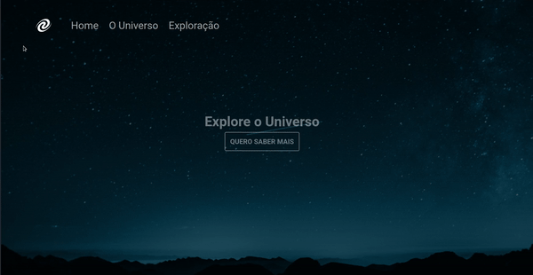

# SPA Universe

Projeto de uma Single Page Application, apenas na versão Desktop no momento.

## Pré Visualização

## Sobre

Este é o primeiro projeto de SPA (Single Page Application) proposto no Stage 6 no [Explorer da Rocketseat](https://www.rocketseat.com.br/explorer).SPA são aplicações cuja funcionalidade está concentrada em apenas uma página, retornando ao usuário, as informações de seu interesse de forma mais dinânica, sem a necessidade de recarregar uma nova página.

[Clique aqui para acessar !]()

## ⌨️ Tecnologias

- HTML
- CSS
- Javascript
- NodeJs

## Conceitos Aplicados no Projeto:

- Conceitos de SPA;
- Mapeamento de rotas;
- Assíncrono e promises;
- Orientação a objetos;
- Classes.

##  ❤️ Contato
- paula.tcelso@gmail.com
- [LinkedIn.](https://www.linkedin.com/in/paulatartarotticelso/)